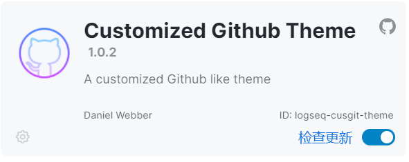

<h1 align="center">
  
  <br>logseq-cusgit-theme<br>
</h1>

<p align="center">
  <a href="#screenshots">🌠 Screenshots</a>
   | 
  <a href="#install">📦 Install</a>
   | 
  <a href="#whats-improved">✨ What's different</a>
  
</p>


This is a clean theme for [Logseq](https://github.com/logseq/logseq), focusing on bullet journal and long time writing experience. Sometimes it fixes some UI bugs for Logseq.

## Screenshots

The style is strongly inspired by [logseq-bonofix-theme](https://github.com/Sansui233/logseq-bonofix-theme) and [logseq-github-theme](https://github.com/g1eny0ung/logseq-github-theme). The code is mainly based on [logseq-github-theme](https://github.com/g1eny0ung/logseq-github-theme), and you may find the style really bonofix-like.


## Install

Here are two ways of installing theme in Logseq.
### Install plugin



- Open Logseq → Plugins → Market Place, install **logseq-cusgit-theme** plugin

- Open Logseq → Themes, choose your theme

> The theme installed via plugin is not compatible with your local `custom.css`. Only plugin theme works.
### Install `custom.css`

- General installation

  Copy the whole content of [custom.css](https://raw.githubusercontent.com/mendax1234/logseq-cusgit-theme/main/custom.css) into your `graphname/logseq/custom.css` file.

- If you are always working online

  Copy this one-line-installation into your logseq/custom.css file

  ```css
  @import url('https://cdn.jsdelivr.net/gh/mendax1234/logseq-cusgit-theme/custom.css')
  ```

## What's different

**Functional style**

- Simple but functional colors

- Remove border-bottom for heading, and make `<hr>` slim for title partition in blockbody. 

- Make tippy window like responsive card instead of filling the screen and obscuring text

**Additional Styles**

- Calender emoji before journal title. Credit[@Sansui233](https://github.com/Sansui233)

  

- Rounded tags. Credit[@g1eny0ung](https://github.com/g1eny0ung)

  

- Round checkbox. Credit[@Sansui233](https://github.com/Sansui233)

- Customized Priority style. Credit[@pengx17](https://github.com/pengx17)

  
  
 - Cool query table style! Thanks[#5](https://github.com/mendax1234/logseq-cusgit-theme/issues/5)!
  
  

## How to build

1. Install [node](https://nodejs.org/)
2. Clone repo  
  ```shell
  git clone https://github.com/mendax1234/logseq-cusgit-theme.git && cd logseq-bonofix-theme
  ```
3. Install sass  
  ```shell
npm install
  ```
4. Run build  

  ```shell
  npm run build
  ```

## Thanks

- [Logseq](https://github.com/logseq/logseq)
- [logseq-bonofix-theme](https://github.com/Sansui233/logseq-bonofix-theme) by [@Sansui233](https://github.com/Sansui233)
- [logseq-github-theme](https://github.com/g1eny0ung/logseq-github-theme) by [@g1eny0ung](https://github.com/g1eny0ung)
- [logseq-dev-theme](https://github.com/pengx17/logseq-dev-theme) by [@pengx17](https://github.com/pengx17)
- All feedbacks from email and discord
